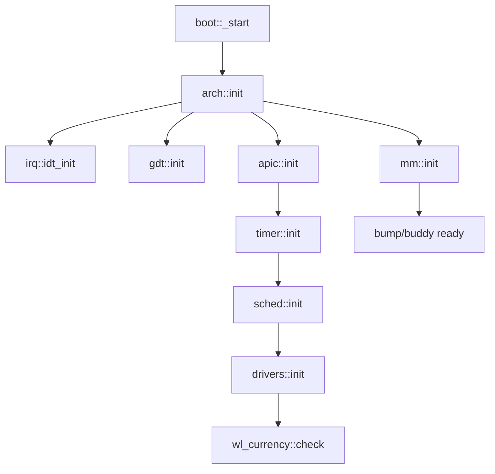

# Plan: Rust Rewrite Bring-up

## Approach

- **Workspace sanity**: Review `Makefile`, `meson.build`, `rust-toolchain.toml`, top-level `Cargo.toml`/`lib/Cargo.toml` to confirm targets (`x86_64-slos.json`) and features match the Rust-only layout.
- **Baseline build probe**: Run `make build` (then `make test`) to capture the first full-error surface; triage by subsystem (boot, mm, sched, drivers, userland). Keep the first failure log.

## Subsystem glue audit & fixes

- **Init order map**: Trace the boot → arch bring-up path (`boot/src/`, `arch/x86_64` if present) to confirm handoff to `mm`, `irq/idt/gdt`, `apic/ioapic`, `timer`, `sched`, and `drivers`. Add a short init sequence comment/map if missing.

- **Memory**: Ensure `mm` allocator (bump/buddy/page tables) is wired to the arch paging setup and exported alloc APIs are used consistently; fix symbol/visibility mismatches.
- **Interrupts/APIC**: Verify IDT/GDT/TSS wiring in Rust; ensure LAPIC/IOAPIC init and interrupt enable sequence matches the expected hardware model (q35). Align handler signatures and ISR table.
- **Timers & sched**: Ensure PIT/HPET/APIC timer driver hands a tick source to `sched`; confirm tick handler is registered and preemption/ctxswitch paths compile and link.
- **Drivers**: Audit PCI/ACPI/video/keyboard for init entrypoints; wire any stubs into `drivers::init` and ensure wl-currency hooks (`wl_award_win/loss`) are invoked on success/failure paths per repo rules.
- **Userland / tests**: Confirm kernel test harness entrypoints (`tests/`, `itests` flags) still link and that command-line parsing matches the new Rust enums/structs.

## Tooling & safety

- **Clippy/format**: Run `cargo fmt`/`cargo clippy` selectively on touched crates to reduce noise (respect `#![no_std]`).
- **Logging/asserts**: Add minimal serial/log breadcrumbs where glue is missing to speed iterative boot attempts; keep comments sparse but clarifying.

## Validation

- **Make targets**: Re-run `make build` then `make test` (QEMU harness) until clean; if boot-only, use `make boot-log` and capture `test_output.log` for regressions (roulette banner, W/L prints).
- **Follow-ups**: Note remaining gaps or hardware assumptions; prepare next steps for deeper device coverage.