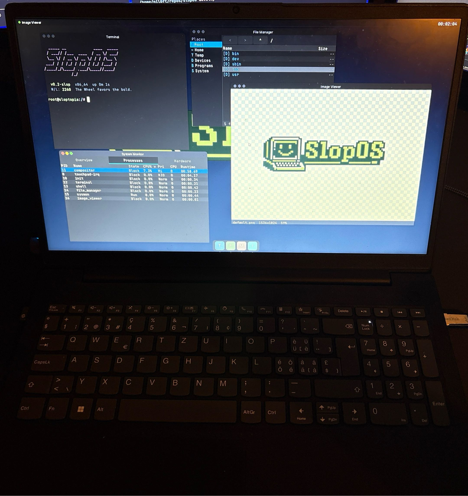

<p align="center">
  
  
  
  
</p>

<p align="center">
  
</p>

<p align="center">
  <i>Three kernel wizards shipwrecked on the island of Sloptopia.<br/>
  Armed with Rust, mass AI token consumption, and zero fear of <code>unsafe</code>,<br/>
  they built an operating system that boots—when the Wheel of Fate allows it.</i>
</p>

<p align="center">
  <b>Win the spin → enter the desktop.<br/>
  Lose → reboot and try again.<br/>
  The house always wins. Eventually.</b>
</p>

---

<br/>

## This Is Not QEMU

<p align="center">
  
</p>

That is a real laptop. The desktop — compositor, terminal, file manager,
system monitor, image viewer — is drawn by our own Intel Xe display driver.
The keyboard and I²C-HID touchpad were discovered by walking the firmware's
actual AML tables with our own ACPI interpreter, then driven over our own
I²C and GPIO drivers. The slop has escaped the sandbox.

<br/>

---

<br/>

## Get It Running

> **You need:** QEMU, xorriso, e2fsprogs, [`just`](https://github.com/casey/just) — plus Go ≥ 1.22 if you want `just test`

```bash
# macOS
brew install qemu xorriso e2fsprogs just go

# Debian/Ubuntu
sudo apt install qemu-system-x86 xorriso e2fsprogs golang
cargo install just  # or: https://github.com/casey/just#installation

# Arch (btw)
sudo pacman -S qemu-full xorriso e2fsprogs just go

# Then:
just setup          # installs the pinned rust nightly
just boot           # spins the wheel
```

| Command | What it does |
|---------|--------------|
| `just boot` | Boot with a display window |
| `just boot-fast` | Skip the Wheel of Fate (coward) |
| `just boot-headless` | Serial only, no window |
| `just test` | Run the 2,500+ test suite under QEMU |
| `just --list` | Everything else (there's a lot) |

<details>
<summary><b>Advanced knobs</b></summary>

```bash
QEMU_DISPLAY=cocoa just boot                       # force a display backend (macOS auto-detects Cocoa)
QEMU_FB_WIDTH=2560 QEMU_FB_HEIGHT=1440 just boot   # manual framebuffer override
just ports=7777,8080 boot                          # expose guest ports on the host
just test FILTER='mm::*'                           # run a subset of the tests
just boot-debug                                    # QEMU GDB stub on :1234
```

</details>

<br/>

---

<br/>

## What's In The Slop

Everything below is `#![no_std]` Rust written for this kernel — no smoltcp,
no borrowed driver crates. When we say the wizards wrote a TCP stack, we
mean the wizards wrote a TCP stack.

**Kernel** — SMP preemptive scheduler, buddy allocator with demand paging
and copy-on-write fork, SYSCALL/SYSRET fast path, LAPIC/IOAPIC + MSI-X
interrupts, futexes, signals, pipes, ppoll, PTYs, process groups, signalfd,
pidfd. A panic gets caught, its backtrace symbolized, and the damage billed
to the offending task's oops ledger — the machine keeps going.

**Drivers** — Intel Xe display (the one in the photo), virtio-gpu/blk/net,
i8042 keyboard with live layout switching (the Swiss QWERTZ in the photo
types its dead keys correctly), and an I²C-HID touchpad sitting on our own
DesignWare I²C and Intel GPIO drivers, wired up by our own ACPI/AML
interpreter.

**Network** — a from-scratch TCP/IP stack: ARP, IPv4, TCP, UDP, ICMP, DHCP,
DNS, unix sockets, NAPI-style ingress. Userland ships `curl`, `ping`, `nc`,
and — for auditing your own two sockets — `nmap`.

**Desktop** — a compositor with damage tracking and occlusion culling,
clients passing buffers over memfd + SCM_RIGHTS (the Wayland trick), an
appkit widget toolkit, and apps: terminal (with scrollback reflow), file
manager, image viewer, system monitor.

**Plumbing** — our own libc (`slibc`) with an mmap-only malloc, an
io_uring-style submission ring (SlopRing), a VFS with ext2, devfs, ramfs,
and an initramfs RAM root that boots with no disk attached at all.

**The economy** — the Wheel of Fate gates every boot, and outcomes accrue
to your W/L balance. The only operating system with a load-bearing gambling
mechanic.

<br/>

---

<br/>

## Actually, The Slop Is Proven

Under the goofy exterior, SlopOS is a **framekernel**: every line of
`unsafe` in the entire kernel is confined to one trusted crate,
`slopos-ostd`, held under a **≤1% TCB budget**. Every other kernel crate is
`#![forbid(unsafe_code)]`, so the compiler itself refuses to let unsafety
leak out of the trusted core — and CI gates inspect the final ELF to keep it
honest: no stack frame over 2 KiB, no SSE instruction anywhere in the
kernel, no `unsafe` outside the sanctum.

The load-bearing invariants of that core are **machine-checked with
[Verus](https://github.com/verus-lang/verus)**, an SMT-backed proof system
for Rust. The proofs cover the spots where a bug would be genuine undefined
behaviour rather than a typed error:

- **Frame reference counts** — no double-free, no use-after-free.
- **Slab slot lifetimes** — a slot can never outlive the slab it came from.
- **Page-table mutation** — every walk stays well-formed; user mappings
  can't reach into sensitive kernel memory.
- **SlopRing cursors & buffer pool** — a hostile userland can't overwrite
  or overflow the shared rings.
- **TCP zero-copy pinning** — a page stays pinned as long as the NIC might
  still read it.

The proofs run in CI on every change and reproduce locally with
`just verify`. For everything they don't cover: 2,500+ tests boot under
QEMU on every change (`just test`), the trusted core runs under Miri
(`just check-miri`), and when a bug only reproduces on Tuesdays, there's
deterministic time-travel debugging (`just rr-record` / `just rr-replay`).

<br/>

---

<br/>

<p align="center">
  <sub>
    <i>"still no progress but ai said it works soo it has t be working :)"</i><br/>
    — from the sacred commit logs
  </sub>
</p>

<p align="center">
  <b>GPL-3.0-only</b>
</p>
